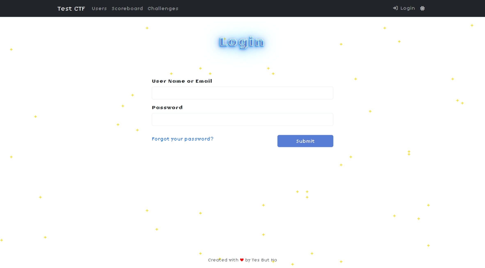

<picture>
  <source media="(prefers-color-scheme: dark)" srcset="./screenshots/title_dark.jpeg">
  <source media="(prefers-color-scheme: light)" srcset="./screenshots/title_light.jpeg">
  
</picture>

# CTFd Astral Theme

A CTFd 8-bit space theme for versions >= 3.7.4. Created by [JusCodin](https://github.com/Jus-Codin) for YBNCTF 2024.

## Features

- Supports CTFd >= 3.7.4
- Custom title screen<sup>[1]</sup>
- Animated background
- CTFd v3.7.4's dark / light mode toggle support
- (Somewhat) Responsive design
- Bigger file download buttons
- ECharts for scoreboard graph now refreshes on color mode change

<sup>[1]: The title screen only works after modifying CTFd's source code. See [Custom Title Screen](#custom-title-screen)</sup>

## Installation

Installation of CTFd themes are relatively simple. You can follow the steps below either in your cloned CTFd repository or in your CTFd Docker container.

1. Clone the repository

   ```bash
   git clone https://github.com/Jus-Codin/ctfd-astral-theme.git
   ```

2. Copy the theme folder to CTFd's themes directory.

   ```bash
   cp -r ctfd-astral-theme/astral /path/to/ctfd/themes/
   ```

3. Enable the theme in CTFd's admin panel.
4. (Optional) If you want to use the custom title screen, follow the instructions in the [Custom Title Screen](#custom-title-screen) section.

## Custom Title Screen
The custom title screen is a simple splash screen that shows up when the user first visits the site. It can be shown again by clicking on the CTF logo in the top left corner in the home page.

To enable the custom title screen, you need to modify CTFd's source code. Follow the steps below:

1. Open `CTFd/views.py` in your CTFd repository.

2. Find the `def index()` function. (Located at line 390 as of CTFd 3.7.4)

3. Modify the function as follows (or refer to [views.py.diff](views.py.diff)):

    ```diff
     @views.route("/", defaults={"route": "index"})
     @views.route("/<path:route>")
     def static_html(route):
         """
         Route in charge of routing users to Pages.
         :param route:
         :return:
        """
         page = get_page(route)
         if page is None:
             abort(404)
         else:
             if page.auth_required and authed() is False:
                 return redirect(url_for("auth.login", next=request.full_path))

    +        if route == "index":
    +            return render_template(
    +                ["index.html", "page.html"], content=page.html, title=page.title
    +            )
    +
             return render_template("page.html", content=page.html, title=page.title)
    ```
 
4. Restart your CTFd server if necessary.

## License

This project is licensed under the Apache License 2.0 - see the [LICENSE](LICENSE) file for details.

## Modifications

Feel free to use this theme and modify it as you wish. Keeping the credits is appreciated but not required. :smiling_face_with_three_hearts:

If you have any questions or suggestions, feel free to open an issue or a pull request.


## Credits

- [JusCodin](https://github.com/Jus-Codin) - Theme Designer
- [ColdHeat](https://github.com/ColdHeat) - [CTFd](https://github.com/CTFd/CTFd) and [core-beta](https://github.com/CTFd/core-beta) theme developer


## Screenshots

#### Title Screen
</img>
</img>

#### Challenge List
</img>
</img>

#### Challenge Description
</img>
</img>

#### Scoreboard
</img>
</img>

#### Users
</img>
</img>

#### Login
</img>
</img>

#### Profile
</img>
</img>

#### Notifications
</img>
</img>
